<div align="center">
  
  <h1>Cabinet Crafter</h1>
  <p><strong>Design an arcade cabinet. Catch fabrication problems before you cut.</strong></p>
  <p>
    An offline Windows workspace for parametric design, hardware fit checks,
    fabrication preflight, stock nesting, costing and workshop-ready exports.
  </p>
  <p>
    <a href="https://github.com/peterBlenkharn/Cabinet-Crafter/releases/latest"><strong>Download for Windows</strong></a>
    &nbsp;&middot;&nbsp;
    <a href="docs/FIRST_PROJECT.md">Build your first cabinet</a>
    &nbsp;&middot;&nbsp;
    <a href="docs/INDEX.md">Documentation</a>
    &nbsp;&middot;&nbsp;
    <a href="SUPPORT.md">Support</a>
  </p>
  <p>
    <a href="https://github.com/peterBlenkharn/Cabinet-Crafter/actions/workflows/ci.yml"></a>
    <a href="https://github.com/peterBlenkharn/Cabinet-Crafter/releases/latest"></a>
    
    <a href="LICENSE"></a>
  </p>
</div>

<picture>
  <source media="(prefers-color-scheme: dark)" srcset="docs/media/readme/hero-dark.png">
  <source media="(prefers-color-scheme: light)" srcset="docs/media/readme/hero-light.png">
  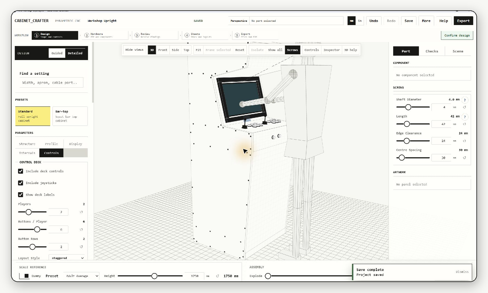
</picture>

<p align="center">
  <a href="docs/media/readme/demo.mp4">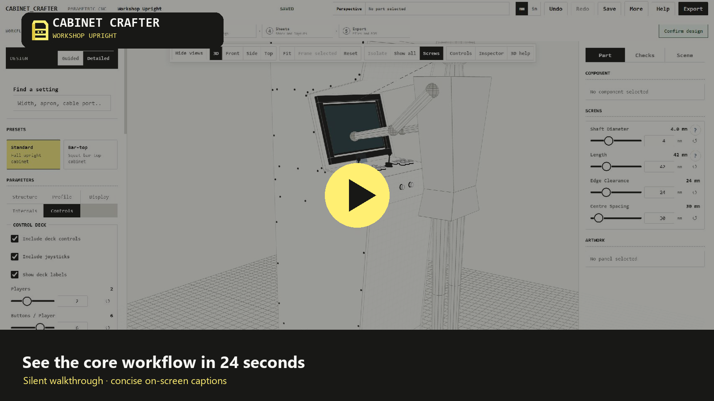</a><br>
  <a href="docs/media/readme/demo.mp4"><strong>Watch the 24-second Workshop Upright tour</strong></a>
</p>

## From first dimension to workshop hand-off

| Design precisely | Catch likely problems early | Leave with a complete pack |
| --- | --- | --- |
| Start with a Standard upright or Bar-top cabinet, then adjust exact dimensions, controls, panels, materials and artwork in an interactive 3D workspace. | Review hardware bodies, clearances, material thicknesses and operations through deterministic fabrication preflight, then validate stock placements in Sheets. | Export annotated drawings, nominal SVG/DXF machine vectors, cut lists, labels, drilling templates, assembly guidance and a costed bill of materials. |

Cabinet Crafter works locally. It requires no account and sends no analytics, telemetry, designs or fabrication output to a Cabinet Crafter service.

## Start in minutes

**[Download the latest published Windows x64 release](https://github.com/peterBlenkharn/Cabinet-Crafter/releases/latest)**

1. Open the release's **Assets** section.
2. Download `CabinetCrafter-<version>-win-x64.zip`.
3. Extract the complete ZIP.
4. Run `CabinetCrafter.exe` from the extracted folder.
5. Then either:
   - choose **Help**, then **Build my first cabinet** for a guided introduction; or
   - open the [Workshop Upright sample project](examples/workshop-upright.cabinet.json): on its GitHub page, choose **Download raw**, then use **More > Open** in Cabinet Crafter.

Cabinet Crafter is portable: there is no installer and normal use does not require administrator access. The package includes its own .NET runtime. It supports Windows x64 and requires the [Microsoft Edge WebView2 Runtime](https://developer.microsoft.com/en-us/microsoft-edge/webview2/), which is normally already installed.

<details>
<summary><strong>Verify the download and understand the release files</strong></summary>

Do not choose GitHub's automatically generated **Source code (zip)** file unless you want the source rather than a runnable application.

GitHub Releases are the normal public download location. GitHub Actions artifacts are short-lived test outputs for maintainers.

The external `.zip.sha256` file lets you verify the downloaded archive. The `RELEASE_MANIFEST.sha256` file inside the extracted application records a fingerprint for every packaged file. The accompanying `.spdx.json` file is a software bill of materials, not another application download.

See the [Windows Release Guide](docs/RELEASE_GUIDE.md) for the PowerShell verification procedure, Windows warnings, updates and troubleshooting.

</details>

## One guarded workflow

The main path is **Design → Hardware → Review → Sheets → Export**. Errors return you to the affected part, warnings require review, and sheet layouts are validated again before a fabrication pack is written.

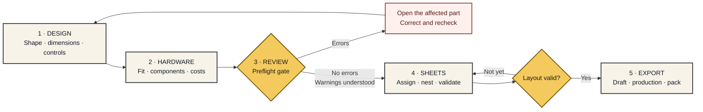

## See each stage clearly

| Design and inspect | Plan real hardware |
| --- | --- |
| [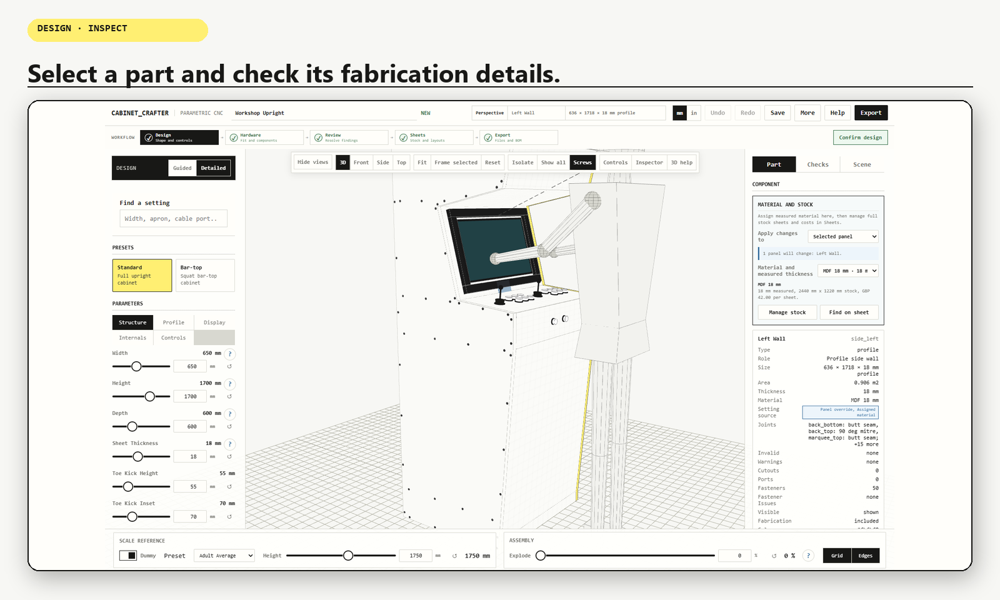](docs/media/readme/design-structure.png) | [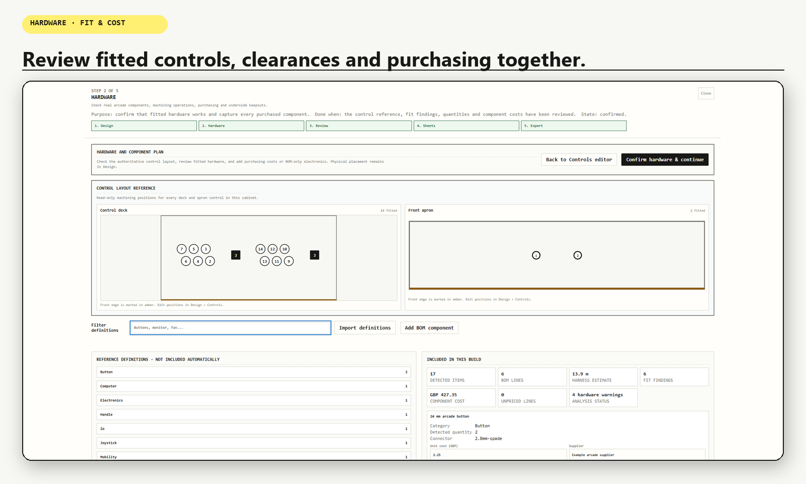](docs/media/readme/hardware-bom.png) |
| Set exact dimensions, switch camera views, select or isolate fabricated panels and preview assembly states. | Inspect control hardware, body keep-outs, fit findings and costs without silently changing the design. |

| Resolve findings | Use stock deliberately |
| --- | --- |
| [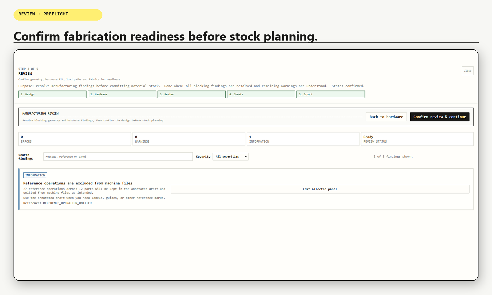](docs/media/readme/review-ready.png) | [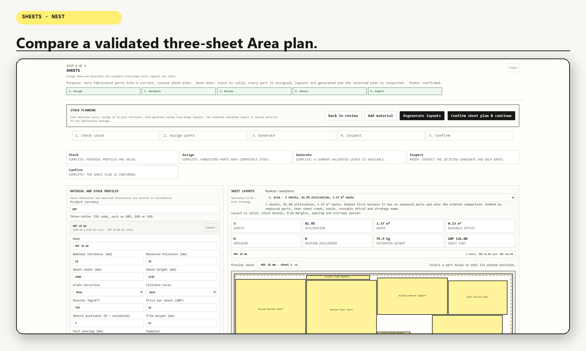](docs/media/readme/sheets-overview.png) |
| Preflight groups errors, warnings and information, then links actionable findings to the responsible part or control. | Assign measured stock, compare ranked layouts and validate position, rotation, spacing, quantity and grain. |

[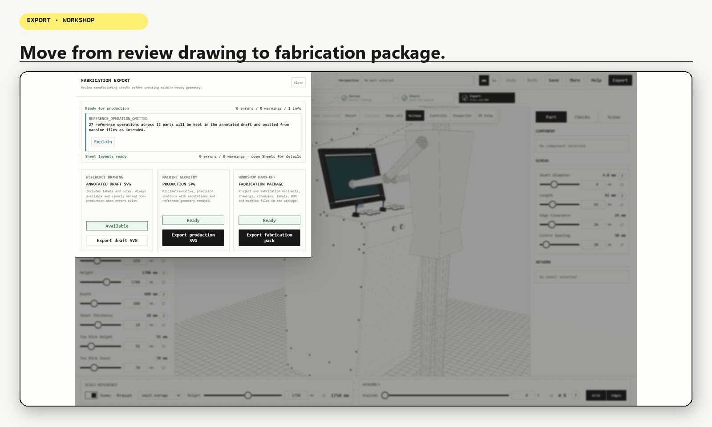](docs/media/readme/export-ready.png)

The annotated draft remains available for review. Production SVG and the fabrication pack stay blocked until required checks pass.

<details>
<summary><strong>Explore the Workshop Upright setup</strong></summary>

| Set the working height | Match the display frame |
| --- | --- |
| [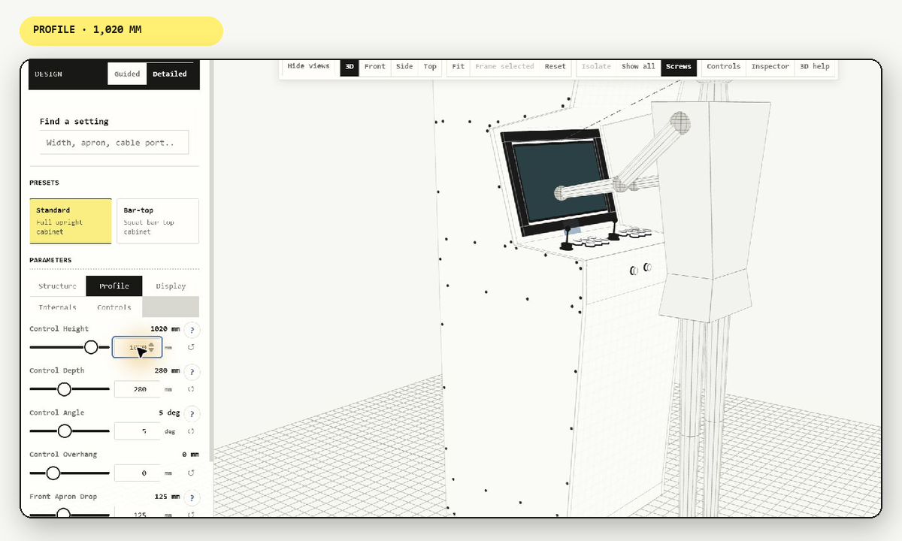](docs/media/readme/design-profile.png) | [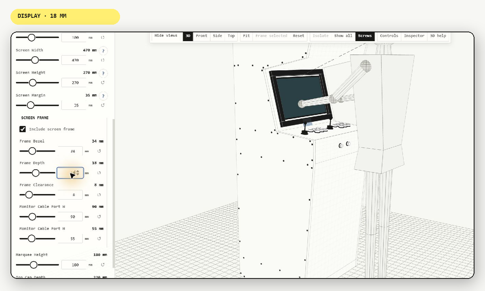](docs/media/readme/design-display.png) |

| Lay out player controls | Check the physical arrangement |
| --- | --- |
| [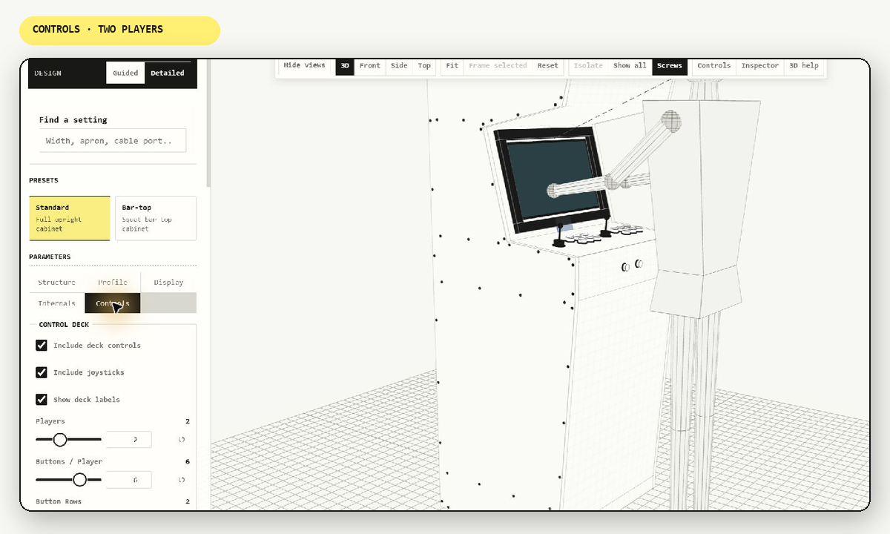](docs/media/readme/design-controls.png) | [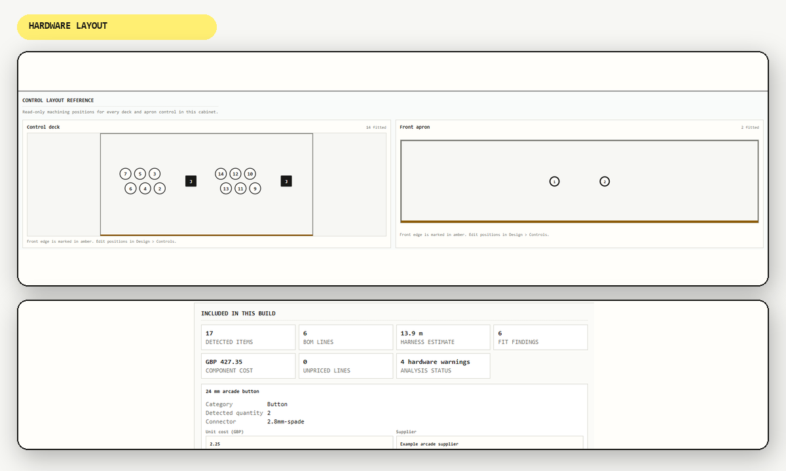](docs/media/readme/hardware-layout.png) |

</details>

## What the fabrication pack contains

A validated fabrication ZIP can include:

- material-grouped sheet SVG and DXF files;
- a 100 × 100 mm calibration contour;
- fabricated-part and total procurement bills of materials;
- cut, joint, fastener, operation and hardware schedules;
- stock, costing, wiring, ergonomics and preflight reports;
- part labels, 1:1 drilling templates and assembly guidance; and
- versioned project, fabrication, nesting and package manifests.

See [Exports and Project Files](docs/EXPORTS.md) for the exact contracts.

## Scope and workshop safety

> [!CAUTION]
> Cabinet Crafter produces nominal geometry for downstream CAM. It does not generate G-code, choose tools, set feeds or speeds, control machinery or verify a physical workshop. Confirm dimensions, material thickness, supplier drawings, CAM settings and machine behaviour, then make a representative test cut before committing stock.

Read [Before You Cut](docs/BEFORE_YOU_CUT.md) before using production geometry.

The desktop workflow currently supports **Standard upright** and **Bar-top** cabinets. Cocktail, sit-down, pinball and general-purpose cabinet families are outside the current scope. Hardware definitions can be inspected and costed, but arbitrary placement of non-control hardware is not yet a complete desktop workflow. See [Implementation Status](docs/IMPLEMENTATION_STATUS.md) for the current maturity map.

## Find the right documentation

| I want to… | Start here |
| --- | --- |
| Install or troubleshoot the Windows app | [Windows Release Guide](docs/RELEASE_GUIDE.md) |
| Complete a first design | [First Project](docs/FIRST_PROJECT.md) · [UI Workflows](docs/UI_WORKFLOWS.md) |
| Prepare for fabrication | [Before You Cut](docs/BEFORE_YOU_CUT.md) · [Exports](docs/EXPORTS.md) · [Fabrication Diagnostics](docs/FABRICATION_DIAGNOSTICS.md) |
| Understand capabilities and limits | [Project Brief](docs/PROJECT_BRIEF.md) · [Implementation Status](docs/IMPLEMENTATION_STATUS.md) · [Privacy and Offline Use](docs/PRIVACY_AND_OFFLINE.md) |
| Understand the code and geometry | [Architecture](docs/ARCHITECTURE.md) · [Geometry Pipeline](docs/GEOMETRY_PIPELINE.md) |
| Contribute or maintain a release | [Contributing](CONTRIBUTING.md) · [Repository Guide](docs/REPOSITORY_STRUCTURE.md) · [Release Process](docs/RELEASING.md) |

The [Documentation Index](docs/INDEX.md) contains the complete reference.

## Build and contribute

Install the .NET SDK selected by `global.json` and the Microsoft Edge WebView2 Runtime. Node.js 20 or later is required for the test suite.

```powershell
git clone https://github.com/peterBlenkharn/Cabinet-Crafter.git
cd Cabinet-Crafter
dotnet restore CabinetCrafter.csproj --locked-mode
dotnet run --project CabinetCrafter.csproj
```

Run the automated tests with:

```powershell
npm test
```

Bug reports, fabrication-domain feedback, accessibility improvements, documentation fixes and focused code changes are welcome. Read [Contributing](CONTRIBUTING.md) before starting a substantial or compatibility-sensitive change.

## Support, security and licence

Start with [Support](SUPPORT.md), then use the appropriate [GitHub issue form](https://github.com/peterBlenkharn/Cabinet-Crafter/issues/new/choose) for reproducible bugs, usage questions or focused feature requests. Report vulnerabilities through the security reporting process in the [Security Policy](SECURITY.md), without publishing exploit details or private project data.

Cabinet Crafter's original work is available under the [MIT Licence](LICENSE). Bundled components retain their upstream terms, recorded in [Third-Party Notices](THIRD_PARTY_NOTICES.md).

Copyright © 2026 Peter Blenkharn. CumberlandQuail is the publisher name. For personally signed official releases, the expected Authenticode signer is Peter Blenkharn.
