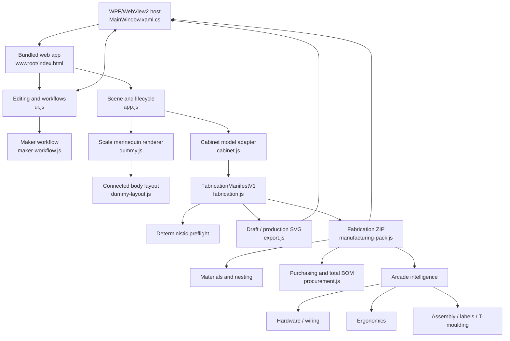

# Architecture

Status: canonical
Last updated: 2026-08-10

## Runtime Shape

Cabinet Crafter is a WPF desktop application hosting a bundled browser app through Microsoft WebView2. The viewport and editing UI run locally; project and export files cross an explicit message bridge to native Windows dialogs.

Advanced modules `joinery.js`, `artwork-production.js`, and `workshop.js` expose tested package options. Persisted `fabricationSettings` can enable their package hooks, but they do not have rich desktop editors. See [Implementation Status](IMPLEMENTATION_STATUS.md).

## Desktop Shell And File Bridge

`MainWindow.xaml.cs` resolves `wwwroot` from the application output directory, with a source-tree fallback for development, maps it to `http://app.local`, and navigates WebView2 to the local app. Browser data is stored under LocalAppData.

The injected `window.cabinetDesktop.request(type, payload)` bridge supports:

- `project.open`, `project.save`, `project.saveAs`, `project.current`, and `project.recent`;
- `project.autosave.write`, `project.autosave.read`, and `project.autosave.clear`;
- `export.saveText` and `export.saveBinary`.

The host uses native dialogs, atomic UTF-8 project writes, a LocalAppData autosave, recent-project records, and error responses that the browser UI surfaces. `Ctrl+S` and `Ctrl+O` are dispatched to the web application. Debug builds additionally support `F5` reload and `F12` development tools. Browser downloads and local storage remain development fallbacks when the host bridge is unavailable.

`CabinetCrafter.csproj` marks `wwwroot/**/*` as content copied to both build and publish output. This is release-critical: the published executable must not depend on the source tree.

## Browser App Responsibilities

### `app.js`

- Owns the Three.js scene, renderer, active perspective/orthographic camera, orbit controls, raycasting, and render loop.
- Instantiates `Cabinet`, `ScaleDummy`, and `UIManager`.
- Implements front/side/top/perspective switching, fit/reset, frame-selected, isolate, show-all, resize, and view-state capture/restoration.

### `cabinet.js`

- Owns runtime `params`, presets, component overrides/colours, decals, visibility/inclusion state, and the current geometry adapter.
- Builds side-profile and rectangular panel meshes, hardware meshes, joints, screw references, and legacy diagnostic metadata.
- Disposes replaced mesh geometry, edge geometry, materials, and generated textures during rebuild/removal.
- Exposes `getFabricationManifest()` and `getPreflightResults()` as the bridge from cabinet state to the pure fabrication contract.

The fabrication contract is renderer-independent once constructed. The current `createManifestFromCabinet` adapter still snapshots Cabinet model/panel metadata; downstream diagnostics, nesting, reports, and exporters do not consume Three.js geometry or rounded drawing labels.

### `dummy.js` and `dummy-layout.js`

- `dummy-layout.js` calculates a renderer-independent body envelope and connected shoulder, elbow, hand, hip, knee, and ankle endpoints from the selected height and proportion profile.
- `dummy.js` consumes that single layout to create the Three.js mannequin meshes and wireframe edges.
- Adjacent limb segments reuse the same joint coordinates. Rebuilding after a preset, height, cabinet-depth, or visibility change therefore cannot separate the limbs or accumulate stale geometry.
- The pure layout module is covered by headless proportion, connectivity, finite-coordinate, and rebuild-stability tests.

### `ui.js`

- Binds parametric controls, exact inputs, units, resets, presets, component tuning, controls, decals, and mannequin/viewport controls.
- Owns the connected project name, dirty state, undo/redo history, autosave recovery, desktop/browser file workflow, keyboard shortcuts, and accessible live notifications.
- Renders the panel inventory, selected-component inspector, severity-grouped preflight cards, fit-suggestion actions, and gated export dialog.
- Exposes selected/scoped component material assignment and contextual routes into stock management and the current sheet placement.
- Instantiates `MakerWorkflow` and passes its validated material/nesting options into fabrication-package export.

### `maker-workflow.js`

- Owns the **Design -> Hardware -> Review -> Sheets -> Export** navigation and maker workspace dialogs.
- Provides a read-only control-layout reference, hardware-library search/import, current inferred schedules/findings, per-definition purchasing overrides, and additional BOM-only component editing.
- Provides material/stock editing including uncut size, measured thickness, price, supplier/SKU/notes, part assignments, per-material cost summaries, actionable findings, ranked true-shape candidates, sheet previews, numeric placement/rotation, pins, exclusions, validation, and export-plan handoff.
- Provides recent-project and device-local user-preset UI.

### `project-document.js`

Defines `ProjectDocumentV2` creation, validation, explicit legacy migration, serialization, safe file naming, the desktop-request helper, and a reusable bounded `ProjectHistory` class. `export.js` adapts live Cabinet state to this contract.

### `fabrication.js`

Defines `CabinetCrafter.FabricationManifestV1`, typed operations, manifest construction, `PreflightResult`, deterministic preflight, summaries, and layout-fit suggestions. It contains no Three.js imports and runs under the browser, Node test runner, a worker, or a future native exporter.

### `export.js`

Orchestrates project save/load, draft SVG, production SVG, preflight gating, native/browser delivery, and the fabrication-package entry point. Production serialization consumes the manifest rather than rendered mesh shapes.

### Manufacturing services

- `manifest-utils.js`: manifest indexing and normalized part/operation helpers.
- `materials.js`: `MaterialProfile` normalization, validation, assignment, stock/supplier metadata, cost, area, and weight summaries.
- `nesting.js`: deterministic true-shape, multi-candidate, multi-sheet packing and validation.
- `procurement.js`: hardware cost/additional-item normalization, costed schedules, and versioned material-plus-hardware procurement BOM summaries.
- `manufacturing-pack.js`: gated ZIP creation, safe rotated sheet SVG/DXF transforms, calibration file, fabricated-part and total procurement BOMs, CSV/JSON/HTML reports, labels, 1:1 drill templates, drawings, and optional advanced-package records.
- `hardware-library.js`: portable hardware definitions, manufacturing operations, keepouts, validation, schedules, and wiring estimates.
- `arcade-intelligence.js`: package-time aggregation of hardware, ergonomics, assembly, wiring, and T-moulding results.
- `ergonomics.js`: reference-profile ergonomic analysis.
- `assembly.js`: assembly plan, labels, T-moulding schedules, and Markdown serialization.
- `joinery.js`: opt-in joinery and process-manifest derivation; it reports missing mating-edge geometry and keeps router holding tabs as guidance metadata.
- `artwork-production.js`: opt-in full-scale artwork template generation/validation.
- `workshop.js`: opt-in workshop profiles, variants, batches, and quote generation.

## Data Ownership And Contracts

`Cabinet.params` remains the canonical live design state. `componentOverrides`, generic control settings, material/fabrication settings, and `fabricationInclusion` travel with the design. Fabrication settings include part-to-material assignments, nesting state, project currency, detected-hardware `hardwareCosts`, and BOM-only `additionalHardware`. `Cabinet.hiddenPanelIds` controls viewport visibility only; `fabricationInclusion[partId]` controls whether a part is manufactured. These states are independent. Additional hardware is a procurement record and does not become a fabrication instance.

`ProjectDocumentV2` is the persistence boundary. It contains identity/timestamps, internal/display units, design parameters and decals, material records, fabrication settings, inclusion state, view/mannequin state, and assets. The migration layer preserves legacy parameter keys and component IDs.

`FabricationManifestV1` is the manufacturing boundary. It contains unrounded millimetre materials, parts, contours, joints, fasteners, keepouts, typed operations, layout-fit suggestions, and source diagnostics. Production-side consumers use the manifest rather than querying UI DOM or Three.js objects.

## Testing And Distribution

The dependency-free Node test suite covers project migration/history, manifest/preflight, golden presets, materials, nesting, hardware, procurement/BOM reconciliation, arcade intelligence, ergonomics, assembly, joinery/process derivation, artwork templates, workshop planning, package contents, SVG/DXF contracts, ZIP validity, and publish-asset declarations.

`.github/workflows/ci.yml` runs those tests on Windows, restores and builds .NET 9, publishes a self-contained Windows x64 application, runs `tests/publish-smoke.mjs`, invokes the packaged executable's `--smoke-test` startup mode, and uploads the ready-to-run publish directory. The asset check asserts the executable, `wwwroot/index.html`, styles, application modules, and vendored Three.js runtime assets are present.
