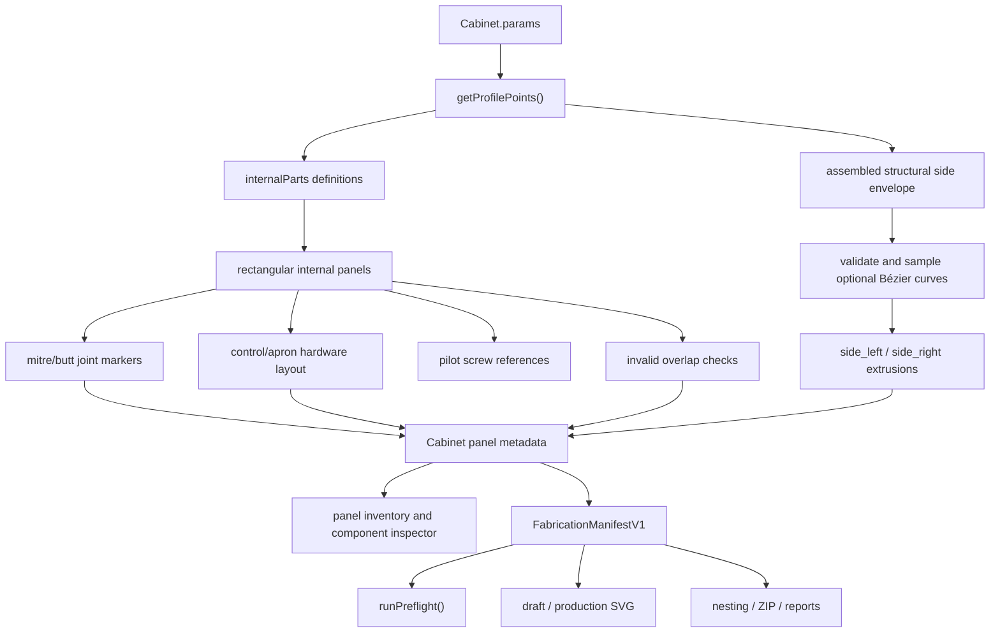

# Geometry Pipeline

Status: canonical
Last updated: 2026-07-31

## Overview

The cabinet is generated from a 2D side-profile polygon plus rectangular panels that span between the left and right side walls.

`Cabinet.build()` is the main geometry entry point.

Three.js meshes remain the viewport representation and the current Cabinet-to-manifest adapter snapshots Cabinet panel metadata. `FabricationManifestV1` is the downstream manufacturing boundary: preflight, machine serialization, nesting, BOMs, schedules, labels, and reports consume plain unrounded millimetre records rather than drawing annotations or rounded mesh labels.

## Coordinate System

The side profile uses a 2D X/Y coordinate system before being placed in the 3D scene.

- X: rear-to-front cabinet depth.
- Y: floor-to-top cabinet height.
- Z: cabinet width.

The cabinet group is shifted by `-depth / 2` in X so the model is centered around the scene target.

## Side Profile Points

`getProfilePoints()` returns named points. These names are canonical internal geometry terms.

| Point | Meaning |
| --- | --- |
| `back_bottom` | Rear bottom corner. |
| `back_top` | Rear top corner. |
| `marquee_top` | Rearward top cap/front transition. |
| `marquee_front` | Upper marquee face point. |
| `marquee_bottom` | Lower marquee face point. |
| `bezel_top` | Upper monitor/bezel panel point. |
| `cp_back` | Rear edge of control-panel deck. |
| `cp_front` | Front edge of control-panel deck. |
| `cp_apron` | Top of front apron/kick transition. |
| `toe_kick` | Toe-kick setback point. |
| `bottom_front` | Bottom front setback point. |

The solver clamps progressive Y positions to avoid obvious self-intersections. This defensive clamp is part of the profile contract.

The optional decorative side profile is a separate persisted cubic Bézier contour. Its anchor and handle coordinates are normalized against the assembled structural side-envelope bounds, while values outside that range add material. Each wall can use the shared curve or an independent curve. The curve is flattened with the same production sampling settings in the editor and geometry build. A valid final contour must be simple, bounded in complexity, and contain the complete structural envelope without any inward boundary excursion.

Internal panels, full-height profile supports, joints, slots, fasteners, and assembly placement always use the structural profile. Only `side_left` and `side_right` use the resolved decorative contour. Invalid or missing enabled curves fall back to the structural outline for a safe viewport, record `SIDE_PROFILE_INVALID` or `SIDE_PROFILE_MISSING`, and block production preflight until repaired or reset.

## Component IDs

Component IDs are stable and used by selection, decals, overrides, panel inventory, and SVG export.

| ID | Name | Type |
| --- | --- | --- |
| `side_left` | Left Wall | side profile extrusion |
| `side_right` | Right Wall | side profile extrusion |
| `panel_back` | Back Access Panel | rectangular panel |
| `panel_top` | Top Roof Panel | rectangular panel |
| `panel_marq_top` | Marquee Top Face | rectangular panel |
| `panel_marquee` | Marquee Graphic Face | rectangular panel |
| `panel_recess` | Upper Cabinet Recess | rectangular panel |
| `panel_bezel` | Monitor Bezel | rectangular panel with monitor cutout in SVG |
| `panel_cp` | Control Panel Deck | rectangular panel |
| `panel_apron` | Control Panel Apron | rectangular panel |
| `panel_kick` | Front Kick Plate | rectangular panel |
| `panel_toe` | Toe Kick Panel | rectangular panel |
| `panel_bottom` | Bottom Floor Panel | rectangular panel |
| `panel_cp_support` | Control Deck Support | profile-fitted horizontal structural panel |
| `panel_control_riser` | Control Profile Support | first continuous full-height cabinet-profile spine; the legacy ID is retained for project compatibility |
| `panel_control_riser_2` | Control Profile Support 2 | optional second continuous full-height cabinet-profile spine |
| `panel_display_support` | Display Bottom Support | rear-to-display horizontal structural panel with an angle-matched front end |
| `panel_header_support` | Header Support | profile-fitted wedge support at the display-to-recess junction |
| `panel_machine_shelf` | Raised Machine Shelf | profile-fitted horizontal structural panel |
| `panel_back_service_door` | Rear Service Door | detached fitted rectangular fabrication part |
| `screen_frame_top_rail` | Screen Frame Top Rail | detached rectangular fabrication part |
| `screen_frame_bottom_rail` | Screen Frame Bottom Rail | detached rectangular fabrication part |
| `screen_frame_left_stile` | Screen Frame Left Stile | detached rectangular fabrication part |
| `screen_frame_right_stile` | Screen Frame Right Stile | detached rectangular fabrication part |

The service-door and screen-frame records are derived at the Cabinet-to-manifest boundary from the parent back/bezel geometry. They have stable identities and enter BOM, nesting, labels, and package output, although they are not selected as ordinary parent-panel meshes in the same way as the core Cabinet panels.

## Panel Metadata

Each selectable mesh stores a `userData` object with fabrication and UI metadata.

Important fields:

- `id`: stable component ID.
- `name`: human-readable component name.
- `role`: concise purpose.
- `exportType`: `profile` or `rectangle`.
- `length`: current fabricated panel length or profile height envelope.
- `width`: current fabricated panel width or profile depth envelope.
- `thickness`: effective component thickness.
- `areaMm2`: approximate flat panel area in square millimetres.
- `baseLength`: unmodified rectangular panel length before `lengthDelta`.
- `baseWidth`: unmodified rectangular panel width before `widthDelta`.
- `override`: resolved per-component override values.
- `baseColor`: resolved panel face colour.
- `intersections`: material-thickness joint lines touching this panel.
- `invalidIntersections`: overlap warnings touching this panel.
- `warnings`: panel-scoped fabrication and layout warnings.
- `hardwareCutouts`: resolved button/joystick/start cutouts touching this panel.
- `cutoutCount`: cable-port or service-opening cutout/reference count touching this panel.
- `fastenerCount`: pilot screw references generated for this panel.
- `fastenerIssues`: screw validation issues touching this panel.
- `layoutFitSuggestion`: proposed fitted coordinates when the requested control layout exceeds usable panel space; the requested geometry is not silently replaced.
- `includeInFabrication`: whether the part enters the manifest/package.
- `viewportVisible`: current display state, independent of fabrication inclusion.
- `outwardFaceSign`: local broad-face sign used for 3D hardware placement.
- `profilePoints`: final sampled outer contour for a side wall.
- `structuralProfilePoints`: immutable assembled envelope used to validate decorative shaping.
- `profileCustomization`: whether shaping was requested and applied, its linked/side source, fallback reason, and validation details.

## Material Thickness And Intersections

The geometry solver treats material thickness as a fabrication constraint rather than only a visual value.

- Side panels are offset by half the material thickness.
- Internal panels span the clear width between the independently adjustable left and right side panels.
- Side-profile walls use the assembled structural envelope unless a validated decorative contour encloses it.
- Profile points are clamped with a minimum joint clearance derived from material thickness.
- Rectangular panels are solved as material-thickness prisms whose end cuts meet neighbouring panels at the side-profile vertices.
- Full-profile horizontal supports are clipped to the live cabinet side profile at their solved height. They run from the rear skin to the active front shell and meet both wraparound side panels across the clear cabinet width.
- `panel_cp_support` is anchored to the bottom of the control-panel apron. Its top cross-section boundary meets the apron endpoint, and its panel body remains below that line.
- The first control profile support is centred across the clear cabinet width. Selecting two supports places them symmetrically at half the requested spacing on either side of the centreline, with spacing clamped so both fabricated thicknesses remain inside the side walls.
- Each control profile support reproduces the complete cabinet side profile from the bottom/base to the top/roof. The support remains a continuous full-height structural spine instead of stopping at the control bay.
- Every internal horizontal panel and profile support owns one complementary open-ended cross-lap slot at their shared line. The intersection is divided near its midpoint so each part keeps a continuous load path and the horizontal panel slides into the profile support along its length.
- Every generated spine records its panel-local half-slot, and every intersecting horizontal panel records the mating half-slot. The ordinary fabrication manifest contains two mandatory full-depth `throughCut` operations per actual panel-to-spine seam, one on each part. Boundary panels such as the roof and control deck meet the spine perimeter without inventing an out-of-profile slot.
- Slot width contains the mating material thickness plus fit clearance. The paired slots meet at the same joint centre without leaving the thin edge bridge created by a closed full-length rib slot.
- `panel_display_support` runs from the back panel to the display bottom. Its lower cross-section endpoint is at `cp_back`; its upper endpoint is solved on the live bezel line, making the full front end face angle-matched to the display panel.
- `panel_header_support` is anchored at `bezel_top` instead of the cabinet roof. Its outer front endpoint is solved on `panel_recess`, producing the fitted wedge shown at the lower rear of the header cavity.
- Structural supports do not alter the side-wall perimeter.
- Angled profile transitions create mitred end cuts; bottom-line base joints use square butt seams.
- Each rectangular panel selects its outward normal from `faceDir`; this is the source of truth for panel offset, hardware protrusion, and warning placement.
- Each rectangular internal panel records its two endpoint joints.
- Joint markers are drawn as subtle dashed lines on the affected panel surfaces.
- Cross-section polygon overlap checks flag invalid panel intersections after all overrides are applied.
- Side-entry screw references are generated on the side-wall profiles and targeted into the internal panels they fasten.
- Screw references are validated against shaft diameter, screw length, edge clearance, centreline spacing, and opposing-shaft overlap.
- Cable slots in the control support, every control profile support, display support, header support, and machine shelf are stored as typed `throughCut` operations with configurable width, height, and offset. The service-door opening is also a real `throughCut`; a fitted `panel_back_service_door` is generated with hinge/latch reference centres. The optional screen frame generates four real rail/stile parts while its parent-panel placement guides remain `reference` operations. References are shown in drafts and omitted from production machine geometry.
- The fabrication summary groups the joint/intersection count by panel.

These diagnostics feed deterministic manifest preflight. Optional joinery/process derivation can be enabled through persisted advanced package settings or the API; the nominal Cabinet geometry remains available. Strategies that require unavailable panel-local mating-edge geometry report a warning rather than inventing vectors.

## Control Hardware Layout

`getHardwareLayout(panelId, panelLength, panelWidth)` resolves the current `params.controls` schema into fabrication-space hardware records.

- `panel_cp` receives joystick and deck button records.
- `panel_apron` receives start-button records.
- Hardware records are rendered as physical 3D meshes on the outward panel face and converted to typed cut/drill/keepout records in the manifest.
- Layouts that overflow retain their requested coordinates and produce `LAYOUT_DOES_NOT_FIT` plus a fit suggestion. The user must explicitly apply that suggestion or edit the controls.
- The same source layout is reused by manifest construction so the viewport and flat geometry stay aligned.

## Component Overrides In Geometry

`componentOverrides` are applied during `Cabinet.build()`.

Internal rectangular panels:

- `offset` shifts the panel along its local normal.
- `lengthDelta` changes the BoxGeometry X dimension.
- `widthDelta` changes the BoxGeometry Z dimension.
- `thicknessDelta` changes the BoxGeometry Y dimension.

Side profile panels:

- `offset` shifts the side panel outward/inward along Z.
- `thicknessDelta` changes side panel extrusion depth.
- `lengthDelta` and `widthDelta` are intentionally ignored.

## Visual Geometry Style

The canonical style is opaque wireframe:

- Mesh faces are pale and opaque.
- Edges are rendered with `THREE.EdgesGeometry`.
- Selected components use a high-contrast face tint plus dark outlines.
- Decorative lighting and glow effects are intentionally avoided.

## Rebuild Resource Lifetime

Cabinet rebuilds remove and dispose replaced Three.js geometry, edge geometry, materials, and generated textures. Generated render resources use the same disposal path, while fabrication data remains plain serializable records with no renderer-resource ownership.

## Manufacturing Boundary

The manifest assigns stable IDs to parts, contours, operations, joints, fasteners, and keepouts. Operation types are `profileCut`, `throughCut`, `drill`, `pocket`, `engrave`, and `reference`. Production exporters filter by `includeInFabrication`, reject invalid preflight, omit `reference`, and preserve decimal millimetre geometry. See [Fabrication Manifest And Preflight](FABRICATION_DIAGNOSTICS.md) and [Exports And Project Files](EXPORTS.md).
