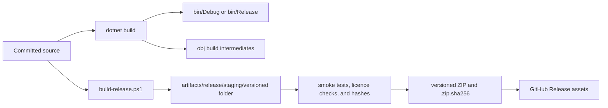

# Repository And Build Folder Guide

Status: canonical
Audience: users, contributors, and maintainers
Last updated: 2026-08-10

Cabinet Crafter has one set of source files and several kinds of generated build output. The generated folders may look repetitive because each serves a different point in the build and release pipeline.

## The Short Version

| Category | Locations | Commit to Git? | Give to end users? |
| --- | --- | --- | --- |
| Source and project metadata | root files, `wwwroot/`, `assets/`, `docs/`, `tests/`, `tools/`, `.github/` | Yes | Through the public repository, not as the Windows app download. |
| Compiler output | `bin/`, `obj/` | No | No. |
| Raw publish output | `artifacts/publish/` | No | No. |
| Staged release candidate | `artifacts/release/staging/` | No | Only for local validation. |
| Finished portable release | `artifacts/release/*.zip` and its `.sha256` file | No | Yes, attach these to a GitHub Release. |
| CI workspace files | `tools/tmp/` and GitHub Actions artifacts | No | No; they are diagnostics or short-lived build evidence. |

The public repository is the source distribution. The versioned ZIP attached to a GitHub Release is the normal Windows binary distribution.

## How A Build Moves Through The Folders

`Debug`, `Release`, and `staging` are not three competing downloads. They are successive tools for developers and maintainers. Only the final versioned ZIP is intended as the normal user download.

## Source Folders

### Root files

- `CabinetCrafter.csproj`, `global.json`, and `packages.lock.json` define the Windows project, SDK, dependencies, version, and locked restore.
- `App.xaml*` and `MainWindow.xaml*` are the native WPF/WebView2 host.
- `README.md` is the public GitHub landing page.
- `LICENSE`, `THIRD_PARTY_NOTICES.md`, and `SECURITY.md` define project licensing, dependency notices, and security reporting.

### `wwwroot/`

This is the local browser application bundled inside the Windows desktop host. It contains the interface, Three.js scene, parametric geometry, workflow state, materials, nesting, hardware, validation, costing, and export logic. It is source and should be committed.

### `assets/`

Source application icons and other repository-owned visual assets. These are inputs to the build, not generated release output.

### `docs/`

Public user, contributor, fabrication, architecture, and maintainer documentation. The root README links into this directory. Selected end-user documents are also copied into each Windows release.

### `tests/`

Automated JavaScript contracts, regression tests, native I/O checks, and publish smoke validation. A nested test project's own `bin/` and `obj/` folders are generated under the same rules as the root ones.

### `tools/`

Release packaging and performance/verification scripts. `tools/build-release.ps1` is the canonical local package builder; `tools/build-release.cmd` is its convenient Windows entry point.

### `.github/`

GitHub Actions definitions and repository automation. The CI workflow checks branches and pull requests. The release workflow responds to a matching version tag and publishes release assets.

## Generated Folders

### `bin/Debug/`

The default local development build. It favours debugging and normally contains symbol files and developer-oriented behaviour. It is useful for running under a debugger, but it is not a clean or supported user package.

### `bin/Release/`

An optimised compiler build. The word `Release` here describes the compiler configuration, not a published GitHub Release. It may still be framework-dependent, lack end-user documents, or contain a layout different from the validated portable package. Do not zip this folder for users.

### `obj/`

MSBuild and compiler intermediates: generated project data, restored asset graphs, caches, and temporary files used to create `bin/` or publish output. It is never a product or source folder.

### `artifacts/publish/`

Raw output from direct or diagnostic `dotnet publish` runs. It is helpful when inspecting publish behaviour, but it is not the canonical release because it has not necessarily passed the repository's complete staging, documentation, notice, manifest, and ZIP checks.

### `artifacts/release/staging/`

The release script's working area. Its versioned child folder is deliberately shaped exactly like the folder a user receives after extraction. Maintainers can run `CabinetCrafter.exe` here for a smoke test. The script recreates this folder, so never edit it as source or store unique work in it.

### `artifacts/release/CabinetCrafter-<version>-win-x64.zip`

The finished portable Windows application. It contains one versioned root folder so extraction does not scatter files into Downloads. This is the primary binary to attach to the corresponding GitHub Release.

### `artifacts/release/*.sha256`

Small text files containing SHA-256 fingerprints:

- `<package>.zip.sha256` verifies the complete downloaded ZIP.
- `<package>.spdx.json.sha256`, created in the GitHub workflow, verifies the software bill of materials.
- `RELEASE_MANIFEST.sha256`, inside the staged/extracted package, verifies each packaged file individually.

Hashes detect changes and download damage. A matching hash does not establish publisher identity; current Windows releases are unsigned.

### `artifacts/release/*.spdx.json`

The GitHub release workflow's machine-readable software bill of materials. It inventories software components detected in the staged package and supports dependency/licence auditing. The complete packaged-file inventory remains `RELEASE_MANIFEST.sha256`. The SPDX file is an accompanying release document, not something an end user opens to start Cabinet Crafter.

### `tools/tmp/`

Temporary server logs, benchmark output, and similar local diagnostics. Nothing here is authoritative or required for a build.

## What Can Be Deleted

With Cabinet Crafter, test processes, and build tools closed, `bin/`, `obj/`, `artifacts/`, and `tools/tmp/` can be removed and recreated from committed source. Deleting them does not remove source code, but it does remove any locally built ZIPs and logs that have not been copied elsewhere.

Do not delete `wwwroot/`, `assets/`, `docs/`, `tests/`, `tools/`, the root project files, or `.github/` as a cleanup operation; those are repository source.

## GitHub Releases Versus Actions Artifacts

- **GitHub Release asset:** a deliberate, versioned public download attached to a tag. This is where normal users should obtain the Windows ZIP and checksum.
- **GitHub Actions artifact:** a temporary output attached to an automation run. It is useful to maintainers while checking a branch or workflow, and may expire automatically.
- **Source code (zip/tar.gz):** archives GitHub generates from the repository for every release. They contain source, not the built Windows application.

For the complete publication checklist, see [Maintainer Release Process](RELEASING.md). For end-user installation, see [Windows Release Guide](RELEASE_GUIDE.md).
